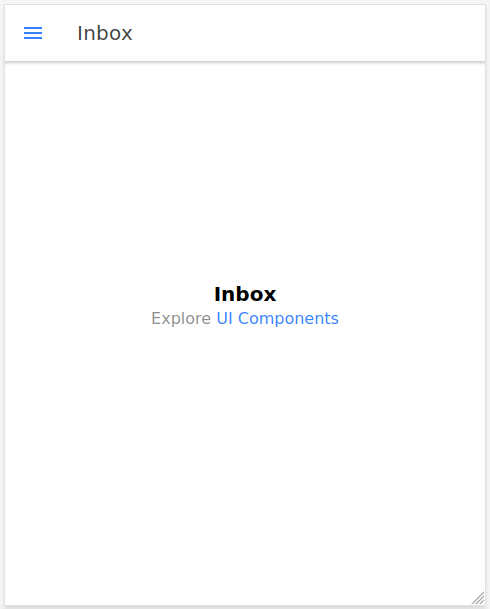
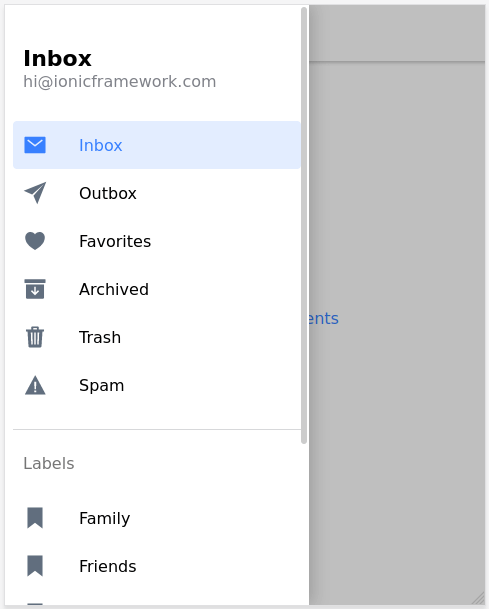

# Ejercicio 5 del capítulo 1

<a href="https://leanpub.com/aprendeionic">
    
</a>

Para crear un proyecto nuevo del tipo `sidemenu`, tecleamos lo siguiente:

```console
ionic start exercise05a sidemenu --type=angular
```

Disponemos, de entrada, de un icono situado en la esquina superior izquierda. Al pulsarlo, se despliega un menú completamente funcional con una serie de opciones que lleva cada una a su correspondiente página, todo ello sin escribir ni una sola línea de código.



<br>



<hr>

:star: Si te ha gustado este repo, dale una estrellita :wink:
